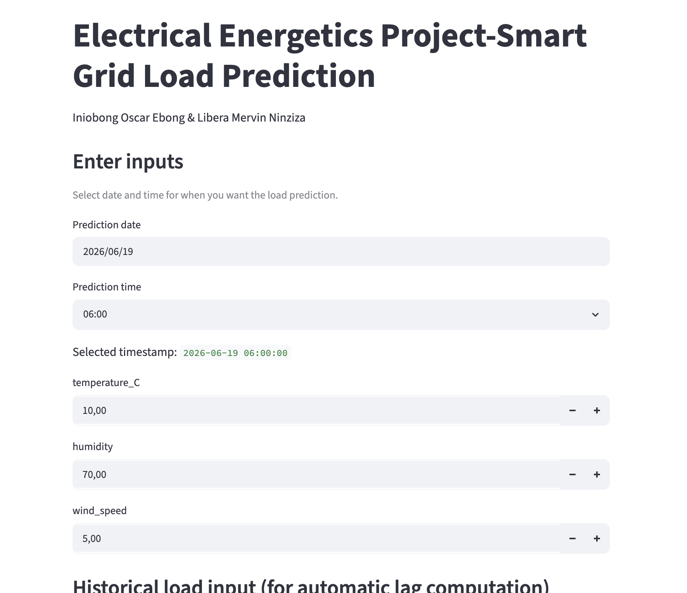
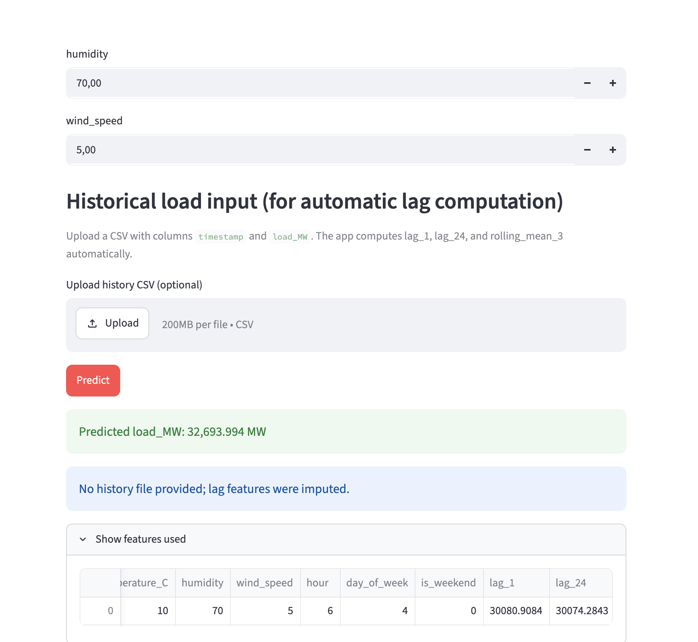

# Smart Grid Load Prediction System

An end-to-end, production-grade Machine Learning architecture designed to forecast electrical grid load ($MW$) using tree-based gradient boosting and auto-regressive feature engineering.

This repository contains the complete pipeline: from synthetic telemetry simulation based on mathematical wave functions, through a leakage-free validation framework, to an interactive Streamlit application optimized for real-time inference.

🔗 **Live Deployment URL:** [Explore the Live Web App Here](https://electrical-load-prediction.streamlit.app/)

---

## 🔬 Academic & Technical Abstract

Accurate short-term load forecasting (STLF) is pivotal for operational security, economic dispatch, and demand-side management in modern smart grids. This project demonstrates a robust framework using an optimized **XGBoost Regressor** benchmarked against a **Seasonal Naive model** and a regularized **Ridge Regression baseline**.

To simulate the non-linear, cyclical, and stochastic nature of actual power grids, we designed a parametric data generator modeling multi-period seasonality and meteorological correlations. A core contribution of this implementation is its **strict temporal isolation protocol**, which guarantees zero data leakage across engineered lag metrics and rolling statistical features—a common pitfall in time-series machine learning.

---

## 🛠️ System Architecture & Data Flow

Understanding how data flows from generation to production inference is key to understanding the system:

1. **Data Generation/Ingestion:** Telemetry data is parsed sequentially based on a strict chronological timeline.
2. **Deterministic Feature Engineering:** Time-lagged transformations and moving windows are generated over a time-sorted index.
3. **Imputation Sandbox:** Missing metrics are resolved via forward-filling and training-set medians to preserve real-time inference conditions.
4. **XGBoost Core Engine:** Regularized gradient boosted trees evaluate non-linear feature splits under early-stopping constraints.
5. **UI Layer (Streamlit):** Web app maps real-time user state arrays into the exact feature space required by the exported serialization artifacts.

---

## 📐 Data Generation & Mathematical Formulation

The system trains on 40,000 consecutive hourly records (~4.5 years of grid logs). To ensure the model learns true underlying physical behaviors rather than just memorizing noise, the synthetic dataset is formulated as a multi-component optimization problem:

$$\text{Load}_{\text{MW}} = \beta_0 + f_{\text{daily}}(t) + f_{\text{seasonal}}(t) + \epsilon_t$$

Where:

- **Base Load ($\beta_0$):** Set statically at $30,000\text{ MW}$ to represent the continuous baseline structural demand of the balancing authority.
- **Daily Cyclical Demand ($f_{\text{daily}}$):** Modeled using a 24-hour sinusoidal harmonic component:
  $$f_{\text{daily}}(t) = 5000 \cdot \sin\left(\frac{2\pi \cdot \text{hour}_t}{24}\right)$$
- **Seasonal Macro Trend ($f_{\mathrm{seasonal}}$):** Modeled via an annual wave tracking climate-driven consumption swings.

- **Stochastic Noise ($\epsilon_t$):** Gaussian white noise introduced to simulate irregular load spikes and metered error variance:
  $$\epsilon_t \sim \mathcal{N}(0, 1000^2)$$

Environmental features like `temperature_C` are similarly generated with periodic annual fluctuations coupled with random micro-variations ($\sigma = 2$).

---

## 📊 Feature Space Matrix

The model interprets a 9-dimensional structured feature array. These variables are categorized below by their operational role:

### 1. Exogenous Meteorological Features

- **`temperature_C` (Continuous):** The primary driver of thermo-sensitive grid stress (e.g., HVAC cooling/heating loads).
- **`humidity` (Continuous):** Real-world relative humidity bounds $[30\%, 100\%]$ to capture latent heat influences on consumer behavior.
- **`wind_speed` (Continuous):** Wind velocity magnitude modeled as an absolute normal distribution.

### 2. Temporal/Chronological Context

- **`hour` (Discrete, $[0, 23]$):** Captures the diurnal human activity cycle (peak evening usage vs. nocturnal valley baselines).
- **`day_of_week` (Discrete, $[0, 6]$):** Captures weekly demand differences (e.g., industry-heavy weekdays vs. lower commercial demand).
- **`is_weekend` (Binary, $[0, 1]$):** High-level flag isolating non-working day load profiles.

### 3. Endogenous Auto-Regressive Features

- **`lag_1` (Continuous):** Immediate persistent state variable representing the actual load from $t-1$ hour.
- **`lag_24` (Continuous):** Seasonal state variable representing the load at the exact same hour on the previous day ($t-24$ hours).
- **`rolling_mean_3` (Continuous):** Short-term momentum tracking feature calculating the moving average of the preceding 3-hour window.

> ### 🛑 Critical Methodology: Eliminating Lookahead Bias
>
> To protect against data leakage, all auto-regressive features (`lag_1`, `lag_24`, `rolling_mean_3`) are engineered using standard historical shifts **prior to any missing value imputation**.
>
> If missing value imputation occurred _before_ the shift, artificial downstream interpolations would leak future information backward into past lags. During evaluation, our recomputed safety schema matched the original features with a $100.0\%$ tolerance verification, ensuring the mathematical integrity of our training data splits.

---

## 📈 Model Training & Optimization Tactics

The dataset is partitioned chronologically (70% Train / 15% Validation / 15% Test) to mirror authentic deployment environments where models cannot train on future information.

### XGBoost Hyperparameter Paradigm

Rather than relying on basic defaults, the system deploys an implementation optimized for stability and regularized generalization:

```python
xgb_model = XGBRegressor(
    n_estimators=5000,          # High budget for fine-grained convergence
    learning_rate=0.05,         # Conservative step-size shrinkage to prevent overshooting
    max_depth=6,                # Balanced tree depth limit to contain interaction complexity
    subsample=0.8,              # Stochastic row bagging to disrupt feature correlation
    colsample_bytree=0.8,       # Feature-wise dropout per split optimization step
    reg_alpha=0.0,              # L1 regularization parameter
    reg_lambda=1.0,             # L2 weight regularization to control leaf score magnitudes
    tree_method="hist",         # Histogram-based binning for structural training speedups
    early_stopping_rounds=200   # Halts training when validation loss stalls for 200 epochs
)
```

---

## 🖥️ Production Inference & Streamlit Web App

The application saves its internal states using structured JSON files and a native weights matrix, ensuring clear decoupling from the training environment:

- `xgb_load_model.json`: Complete gradient boosting ensemble pathway graph.
- `train_medians.csv`: Pure median constants extracted from the training split to enforce deterministic imputations during production feature generation.

### Streamlit Inference Modes:

1. **Manual Entry Framework:** Operators specify arbitrary localized environmental values. If historical variables are unknown, the system safely triggers an alert and uses training dataset medians.
2. **Automated Batch Processing:** Engineers upload recent grid history data streams. The application automatically builds out the required historical lagging features (`lag_1`, `lag_24`, and `rolling_mean_3`) on-the-fly without exposing the pipeline to lookahead bias.

### Interface Previews





---

## 🚀 Execution Guide

### 1. Clone & Initialize Environment

```bash
git clone https://github.com/Osknot/ELECTRICAL-LOAD-PREDICTION.git
cd smart-grid-load-prediction
python -m venv venv
source venv/bin/activate  # On Windows use: venv\Scripts\activate
```
